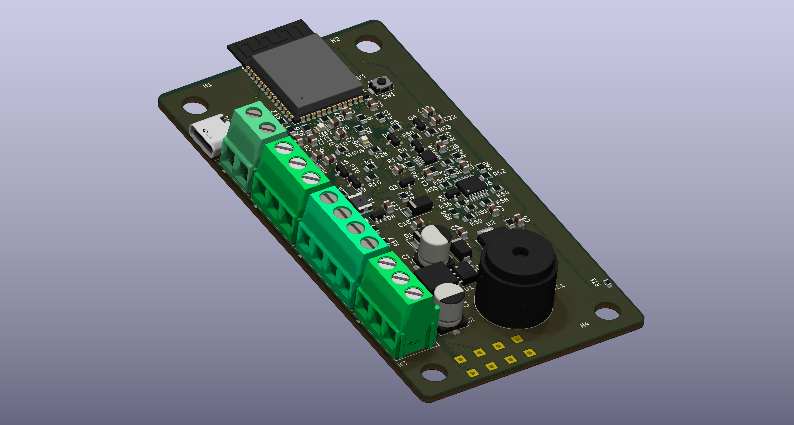
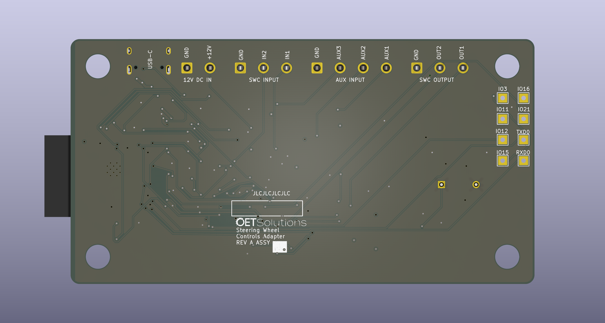

# SWC — Steering Wheel Controls Adapter

A programmable interface between a vehicle's factory steering-wheel buttons and
an aftermarket Android head unit, so the buttons can be re-mapped, combined, or
given press behaviours the factory wiring never had.

**Status:** design complete and routed; 0 DRC errors, 0 unconnected, 0
schematic/PCB parity errors. **Not yet ordered.**

|  |  |
| :--: | :--: |
| **Top** — ESP32-S3 module, four left-edge screw terminals, USB-C | **Bottom** — connector pinouts silkscreened on the back |

| Item | Value |
| --- | --- |
| **Board** | 54.0 × 102.0 mm, 4-layer, 1.6 mm, rounded corners r ≈ 2.83 mm |
| **EDA** | KiCad 10 (`SWC.kicad_pcb` / `.kicad_sch` / `.kicad_pro`) |
| **Assembly** | JLCPCB, 5-off — **Economic if `U3` can be cleared, otherwise Standard** ([MANUFACTURING.md §3](MANUFACTURING.md#3-pcba-type--the-economicstandard-decision)) |
| **Parts** | 34 unique LCSC part types, JLCPCB-assembled |
| **MCU** | ESP32-S3-WROOM-1-N4, native USB-CDC + USB-JTAG |

## Why this exists

A steering-wheel button is not a digital switch. It is a resistor dropped across
a single analog **KEY** line; the head unit pulls that line up and identifies the
pressed button from the voltage it reads. There are usually two such lines —
this board calls them **SWC1** and **SWC2** — with the buttons split between
them.

That arrangement is cheap and robust, and also completely fixed: the resistor
values, and therefore the head unit's behaviour, live in the factory button pod.
An aftermarket head unit wants a specific resistance it was taught, or one the
user can program. This adapter supplies it by reading the ladder on one side and
*servoing* the head unit's KEY line on the other, so the mapping becomes
software. It can additionally send commands to the head unit over USB when a
button is pressed, for actions the head unit's own steering-wheel input cannot
express.

## Architecture at a glance

Two identical channels. The factory ladder is read by the ESP32-S3's ADC; the
head unit's KEY line is driven by a closed-loop servo, so the output tracks what
the board actually senses rather than what it assumes.

```text
  SWC1  J2.3 ─R1 10k─┬─ /SWC1_ADC ─────────► U3 ADC1
  SWC2  J2.2 ─R2 10k─┴─ /SWC2_ADC ─────────► U3 ADC1
        (R15/R16 10k pull-ups to +3V3 · D4/D5 BAT54S clamp · C3/C4 100nF)

  AUX1  J5.4 ─R23 1k─┬─ /AUX1_F ───────────► U3 ADC
  AUX2  J5.3 ─R24 1k─┤   /AUX2_F
  AUX3  J5.2 ─R25 1k─┴─ /AUX3_F
        (R17/R18/R19 10k pull-ups to +3V3 · D8/D9/D10 BAT54S · C15–C17 100nF)

  U3 ESP32-S3 ══ I2C, 3.3 V, R5/R6 10k pull-ups ══ U4 MCP4728  (VDD = +3V3,
       │                                              VREF = VDD, 0–3.3 V FS)
       │                                              ┌ A ─ signal, ch 1
       │                                              ├ B ─ gain mode, ch 1
       │                                              ├ C ─ signal, ch 2
       │                                              └ D ─ gain mode, ch 2
       │
       └─ per channel:  U4.VOUTx ─R46 100k─► U6x− ─(C24 100nF fb)─► U6x out
                                          U6x+ ◄─ R58 82k ─ V_buf
                                              ◄─ R61 100k ─ V_ADJ (VOUTB/D)
                        U6x out ─R52 1k─► Q4 gate ─► Q4 drain = KEY line
                        KEY ─R36 1M─► U6y buffer ─┬─► R54 10k / R50 10k ─► /SENSEx ─► U3 ADC
                                                   └─► R58 (feedback above)

  12 V ─ J1 ─ F1 PPTC ─► /+12V_SW ─► D1 SMBJ18A ─► U1 XL1509-5.0 ─► L1 47µH ─┐
                                                  (D7 SS34 freewheel)         │
  USB VBUS ─ J4 ─ F2 PPTC ─► /VBUS_FUSED ─► D3 SS34 ─┐                        │
                                                     ├─► +5V ─► U2 AMS1117 ─► +3V3
                              /+5V_BUCK ─► D2 SS34 ──┘
  NTC RT1 on /TEMP_ADC · buzzer BZ1 via Q3 · LEDs D6 / D12 · VBUS detect /VBUS_VALID
```

The three ideas that make it work:

- **The ladder is read, not re-created.** 10 kΩ series (1 kΩ on the AUX inputs),
  a BAT54S clamp to +3V3/GND, a filter, and a pull-up — so a bare
  switch-to-ground button works as well as a resistor ladder.
- **The output is a servo, not a buffer.** `V_KEY = (1 + R58/R61)·V_DAC −
  (R58/R61)·V_ADJ`, so the gain is a resistor ratio and the offset is a second
  DAC channel. That gives runtime range switching between 3 V and 5 V head
  units, and it is why the ESP32 needs no DAC of its own (the S3 has none).
- **Idle is inherently high-impedance.** The sink FET only pulls down; a command
  above the head unit's own idle voltage turns it off and the line floats back up
  through a 1 MΩ sense resistor.

Full description, including the analog detail, the power path, the USB front end,
and the reasoning behind each component choice: **[DESIGN.md](DESIGN.md)**.

## Repository guide

| Document | Contents |
| --- | --- |
| **[DESIGN.md](DESIGN.md)** | Requirements, block diagram, theory of operation, design rules, key design decisions |
| **[MANUFACTURING.md](MANUFACTURING.md)** | BOM generation, part list, assembly-cost analysis, fabrication output, ordering decisions |
| **[CHANGELOG.md](CHANGELOG.md)** | Revision history, accepted limitations, open items |
| **[AGENTS.md](AGENTS.md)** | How to work on the files — rules, MCP servers, skills, verify loop, gotchas. `CLAUDE.md` points here. |
| **[tools/README.md](tools/README.md)** | The sanctioned direct-write scripts, in detail |

The live project is `SWC.kicad_sch` / `SWC.kicad_pcb` / `SWC.kicad_pro` /
`SWC.kicad_sym` / the two library tables. `3dmodels/` and
`footprints/logo.pretty/` are required project-local assets; `tools/` holds the
sanctioned direct-write scripts; `SWC-backups/` and `SWC2-backups/` are the
restore path; `old/` is the 2022 RP2040 design, kept for reference only. The
full annotated layout, including what is git-ignored, is in
**[AGENTS.md](AGENTS.md)**.

## Toolchain and credits

This board was developed with a small set of external tools, all worth citing:

- **[KiCad 10](https://www.kicad.org/)** — the EDA suite. All file manipulation
  in this project goes through an MCP server rather than hand-editing.
- **[mcp-server-kicad](https://github.com/ProductOfAmerica/mcp-server-kicad)**
  (`uvx --from mcp-server-kicad mcp-server-kicad`) — the MCP server providing
  byte-preserving schematic, PCB, ERC/DRC and manufacturing-export tools. It is
  the reason every change here is scriptable and repeatable.
- **[pcbparts-mcp](https://github.com/Averyy/pcbparts-mcp)**
  (`https://pcbparts.dev/mcp`) — component search, JLCPCB stock and
  cross-reference, reference-board lookup, and PCB design rules. Used for the
  part-selection and stock-availability pass.
- **[KiStack](https://github.com/American-Embedded/kistack)** by American
  Embedded — a human-written set of KiCad skills (schematic, PCB, BOM, export,
  gerbers, footprint, symbol, panelize, product render) that standardised the
  workflow. Installed with `npx skills add American-Embedded/kistack`.
- **JLCPCB component skills** — `jlcpcb-component-finder` (part search by
  keyword, package, stock and price) and `jlcpcb-bom-generate-from-kicad` (KiCad
  BOM/position → JLCPCB PCBA order format), with its database refreshed from
  [jlcparts](https://yaqwsx.github.io/jlcparts/).

The per-tool notes and the working rules for this repository live in
**[AGENTS.md](AGENTS.md)**.
